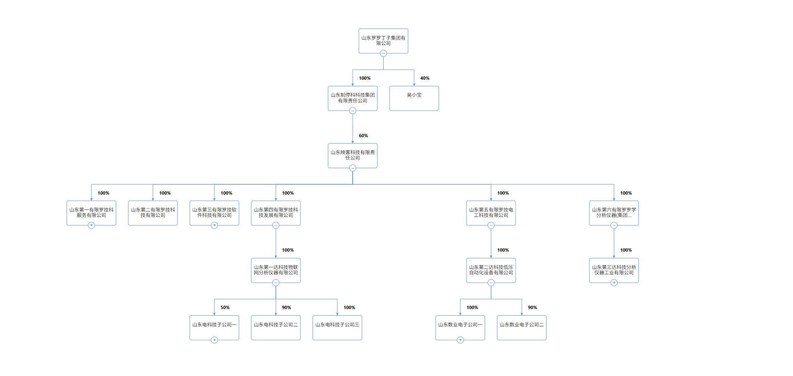

# 股权穿透关系可视化

一个基于React和D3.js的交互式股权穿透关系可视化工具，用于展示公司之间的股权关系和持股比例。



## 功能特点

- 🌳 **树形图可视化**：以树形结构展示公司之间的股权关系
- 🔗 **直观的连接线**：使用箭头和标签清晰展示持股方向和比例
- 🔍 **交互式体验**：支持缩放和平移以查看复杂的股权结构
- 📱 **响应式设计**：适配不同尺寸的屏幕和设备
- 📊 **数据驱动**：易于集成和更新不同的公司股权数据

## 安装与使用

### 前提条件

- Node.js (v14.0.0+)
- npm 或 yarn

### 安装步骤

1. 克隆仓库
   ```bash
   git clone https://github.com/pythonsir/equity-penetration.git
   cd equity-penetration
   ```

2. 安装依赖
   ```bash
   npm install
   # 或
   yarn
   ```

3. 启动开发服务器
   ```bash
   npm start
   # 或
   yarn start
   ```

4. 打开浏览器访问 [http://localhost:3000](http://localhost:3000)

## 数据格式

项目使用JSON格式的数据来描述股权关系。以下是数据格式示例：

```javascript
// 股权穿透数据结构
const sampleData = {
    name: "山东罗罗丁子集团有限公司",
    id: "parent-company",
    value: 100,
    hasChildren: true,
    children: [
        {
            name: "山东制停科科技集团有限责任公司",
            id: "intermediate-company",
            value: 100,
            percentage: 100,
            hasChildren: true,
            children: [
                {
                    name: "山东映客科技有限责任公司",
                    id: "main-company",
                    value: 100,
                    percentage: 60,
                    hasChildren: true,
                    children: [...]
                }
            ]
        },
        {
            name: "吴小宝",
            id: "individual-shareholder",
            value: 40,
            percentage: 40,
            hasChildren: false,
            children: []
        }
    ]
};
```

其中：
- `name`: 公司或个人名称
- `id`: 唯一标识符
- `value`: 节点权重值
- `percentage`: 持股比例（百分比）
- `hasChildren`: 是否有子节点
- `children`: 子公司/持股公司列表

## 技术栈

- [React](https://reactjs.org/) - 用户界面库
- [D3.js](https://d3js.org/) - 数据可视化库
- [CSS3](https://developer.mozilla.org/en-US/docs/Web/CSS) - 样式和动画

## 贡献指南

欢迎提交问题和拉取请求。对于重大更改，请先开issue讨论您想要更改的内容。

## 🔥 关注微信公众号 🔥
### 📱 **老夫撸代码** 📱

## 许可证

本项目采用 [GPL-3.0](https://www.gnu.org/licenses/gpl-3.0.html) 许可证 - GNU通用公共许可证
